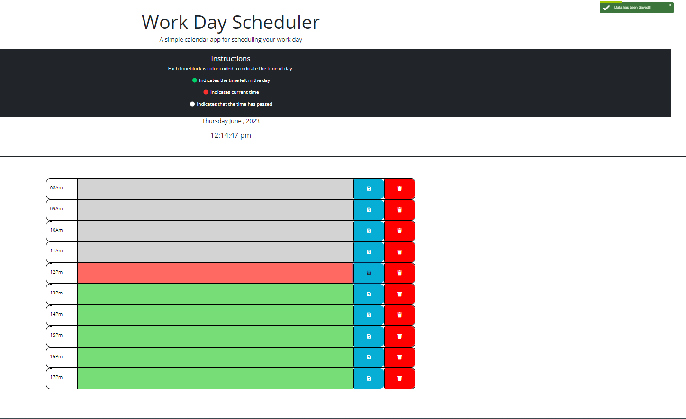

# workSchedule

This is a Work Day Scheduler application using HTML, CSS, and Jquery. This application uses third party for time "day.js". My Daily Planner is a 8am to 5Pm hour time scheduling application that user can save their hourly work into their schedule planner.it  saves user input to localStorage. This app utilizes jQuery for it's easy setup and day.User can show their data by clicking save and delete by Toast Plugin .JS for presenting the current date and color coding each time block based on the time of day. These colors are:

:green_circle: Indicates the time left in the day 

 :red_circle: Indicates current date 

:white_circle: Indicates that the time has passed

This project has been deployed to GitHub Pages. To get this project up and running, you can follow the deployment link. Or, download the sources files to use this as a template.

* [GitHub Repository](https://github.com/LipikaManglaa/workDaySchedule.git)
* [Deployed GitHub IO]
https://lipikamanglaa.github.io/workDaySchedule/

### Prerequisites

To install this application, you will need a text editor. I recommend Visual Studio Code. 

### Installing

To install this code, download the zip file, or use GitHub's guidelines to clone the repository. 

##  User Story:
**AS  a busy schedule for everyone**
- I WANT to add important events to a daily planner
- SO THAT I can manage my time effectively

**# This project has the following features: **
- When user opens the planner 
  - current day and time is displayed at the top 

  

- When user scrolls down,
  - They're presented with time blocks using standard business hours
- When user view the time blocks for that day 
  - Each time block is color coded indicating past, present, and future
- When user clicks onto a time block 
  - They can enter an event

- When the user save data 
 -it can shows by Toast Plugin  ,data has been saved

 

- When the user wants to delete data 
 -it can shows by Toast Plugin  ,data has been deleted

 
 

 ### This project has media Queries for:

* max-width: 991px 
    * Adjusts body and container width

* max-width: 567px
    * Adjusts body and container width
  
